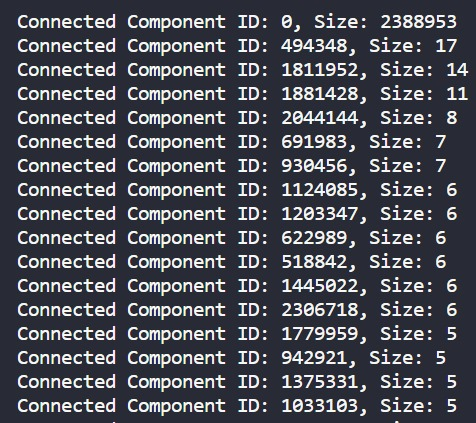
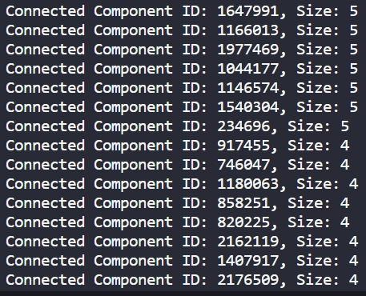
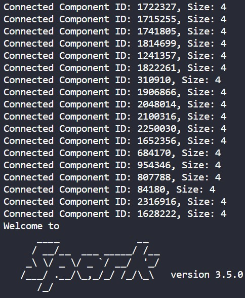

## Title: Analyzing Wikipedia Talk Network with GraphX

### This project uses Apache Spark's GraphX library to analyze the Wikipedia Talk network dataset by finding connected components.

## Tech Stack

- [Apache Spark](https://spark.apache.org/downloads.html): An open-source distributed computing framework.Here we are using Spark 3.5.0
- [Scala](https://www.scala-lang.org/download/all.html): A programming language that integrates smoothly with Spark. Here we are using scala 2.11.12 version
- [OpenJDK](https://openjdk.java.net/): An open-source implementation of the Java Platform.

## Workflow

The workflow of the Project is:

1. Data Loading: The project starts by loading the Wikipedia Talk network dataset using Apache Spark's GraphLoader. Download dataset [here](https://snap.stanford.edu/data/wiki-Talk.html)

2. Connected Components Identification: The GraphX library is employed to identify connected components within the loaded graph.So we used connected component algorithm. This step helps in identifying distinct communities or groups of users based on their interactions in the dataset.

3. Component Size Calculation: After finding the connected components, the algorithm calculates the size of each connected component. This size represents the number of users in each community.

4. Sorting by Size: The calculated component sizes are sorted in descending order, allowing us to identify the largest connected components first.

5. Top 50 Components: The top 50 connected components are selected based on their sizes. These components represent the largest and most prominent user communities within the Wikipedia Talk network.

6. Displaying Results: The project concludes by displaying the IDs and sizes of the top 50 connected components. This information provides insights into the structure and composition of the Wikipedia Talk network, revealing the most significant discussion communities.

## Results

Top 50 connected components.

## Team Members

1. Allu Hanuma Reddy (20bcs008@iiitdwd.ac.in)
2. Erigi Vaishnavi (20bcs044@iiitdwd.ac.in
3. Golla Anjaiah (20bcs048@iiitdwd.ac.in)
4. Kotha Balaji (20bcs073@iiitdwd.ac.in)
